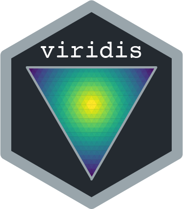

# viridis - Colorblind-Friendly Color Maps for R 

[](https://cran.r-project.org/package=viridis)
[](https://github.com/metacran/cranlogs.app)
[](https://github.com/metacran/cranlogs.app)
[](https://github.com/sjmgarnier/viridis/actions)
[](https://codecov.io/github/sjmgarnier/viridis?branch=master)
[](https://zenodo.org/badge/latestdoi/39225838)


## Description

`viridis`, and its companion package [`viridisLite`](https://cran.r-project.org/package=viridisLite) 
provide a series of color maps that are designed to improve graph readability 
for readers with common forms of color blindness and/or color vision deficiency. 
The color maps are also perceptually-uniform, both in regular form and also when 
converted to black-and-white for printing. 

`viridisLite` provides the base functions for generating the color maps in base 
`R`. The package is meant to be as lightweight and dependency-free as possible 
for maximum compatibility with all the `R` ecosystem. [`viridis`](https://cran.r-project.org/package=viridis)
provides additional functionalities, in particular bindings for `ggplot2`.

---

## The color maps

The latest version of `viridis` comes with 8 different color maps, and they are 
all very pretty!!!


---

## Installation

You can install `viridis` from `CRAN` by typing the following line in your R 
console:

```{r}
install.packages("viridis")
library(viridis)
```

If you prefer to install the development version from this GitHub repository,
simply copy the following lines of code in your R terminal and it should install 
everything you need to use `viridisLite` on your computer: 

```{r}
if (!require("devtools")) 
  install.packages("devtools")

devtools::install_github("sjmgarnier/viridis")
library(viridis)
```

---

## References

The color maps `viridis`, `magma`, `inferno`, and `plasma` were created by 
Stéfan van der Walt ([@stefanv](https://github.com/stefanv)) and Nathaniel Smith ([@njsmith](https://github.com/njsmith)). If you want to know more about the 
science behind the creation of these color maps, you can watch this 
[presentation of `viridis`](https://youtu.be/xAoljeRJ3lU) by their authors at 
[SciPy 2015](https://scipy2015.scipy.org/). 

The color map `cividis` is a corrected version of 'viridis', developed by 
Jamie R. Nuñez, Christopher R. Anderton, and Ryan S. Renslow, and originally 
ported to `R` by Marco Sciaini ([@msciain](https://github.com/marcosci)). More 
info about `cividis` can be found in 
[this paper](https://journals.plos.org/plosone/article?id=10.1371/journal.pone.0199239).

The color maps `mako` and `rocket` were originally created for the `Seaborn` 
statistical data visualization package for Python. More info about `mako` and 
`rocket` can be found on the 
[`Seaborn` website](https://seaborn.pydata.org/tutorial/color_palettes.html).

The color map `turbo` was developed by Anton Mikhailov to address the 
shortcomings of the Jet rainbow color map such as false detail, banding and 
color blindness ambiguity. More infor about `turbo` can be found
[here](https://ai.googleblog.com/2019/08/turbo-improved-rainbow-colormap-for.html).
